##  Функции агрегирования.

### Запросы:

1. Вывести количество преподавателей кафедры “Software Development”.

2. Вывести количество лекций, которые читает преподаватель “Dave McQueen”.

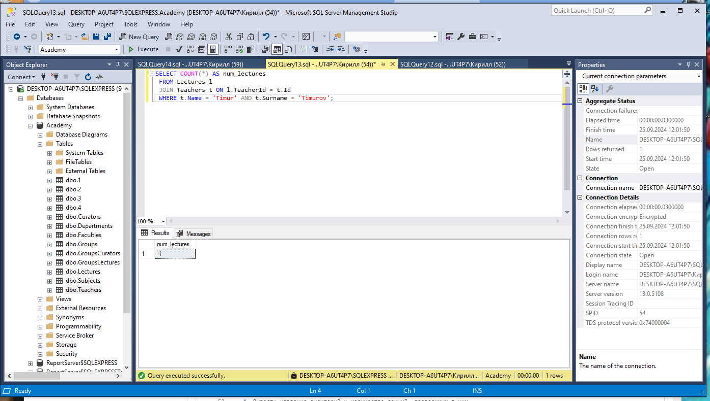

3. Вывести количество занятий, проводимых в аудитории “D201”.

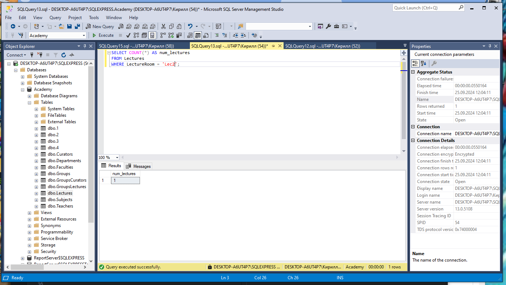

4. Вывести названия аудиторий и количество лекций, проводимых в них.

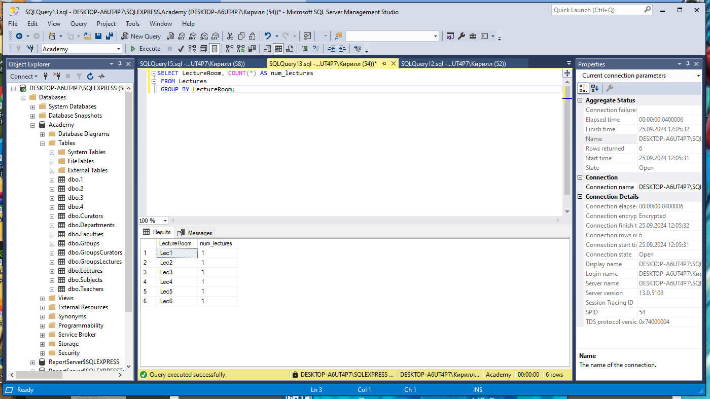

5. Вывести количество студентов, посещающих лекции преподавателя “Jack Underhill”.

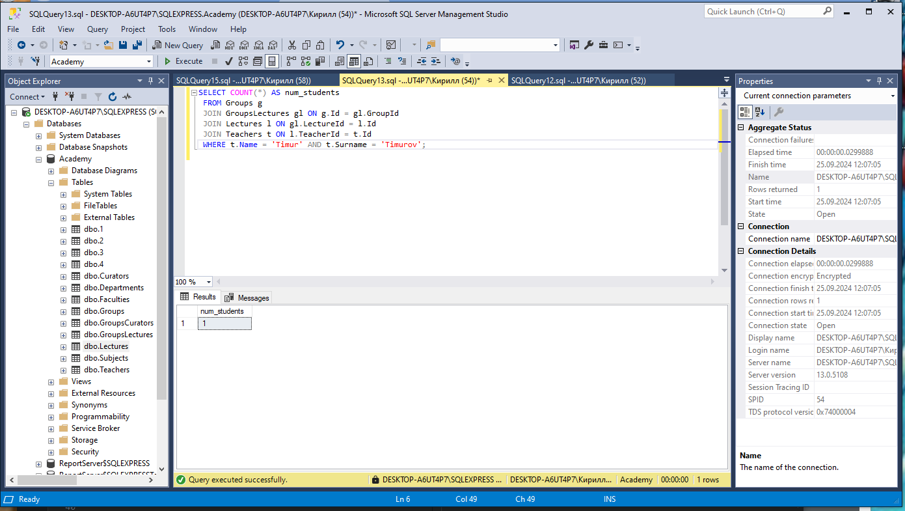

6. Вывести среднюю ставку преподавателей факультета “Computer Science”.

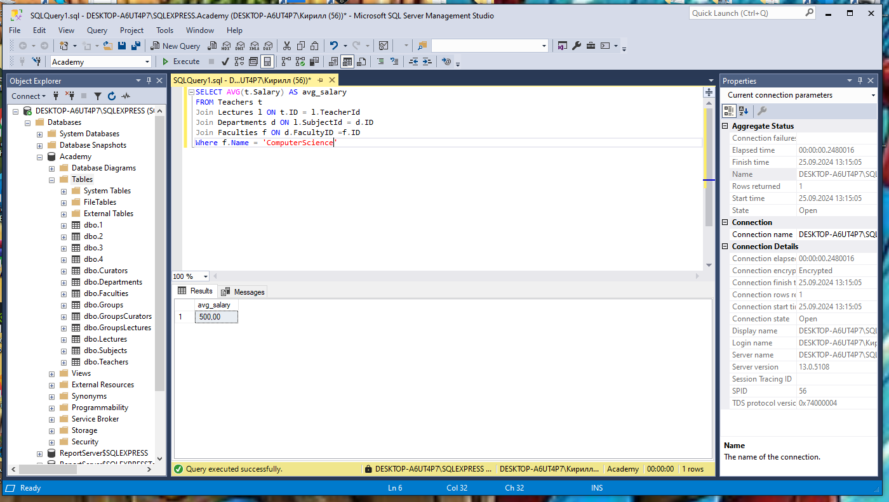

7. Вывести минимальное и максимальное количество студентов среди всех групп.

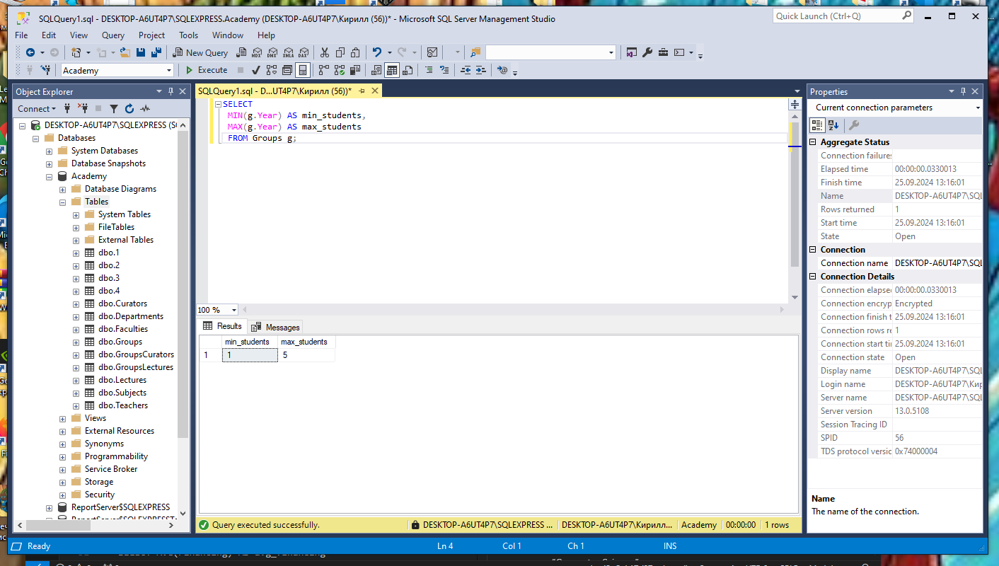

8. Вывести средний фонд финансирования кафедр.

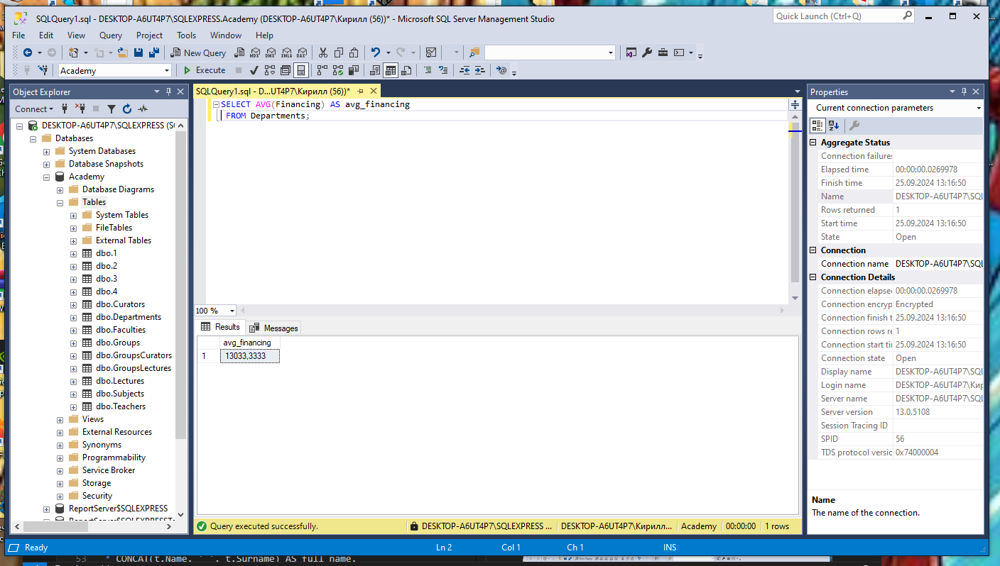

9. Вывести полные имена преподавателей и количество читаемых ими дисциплин.

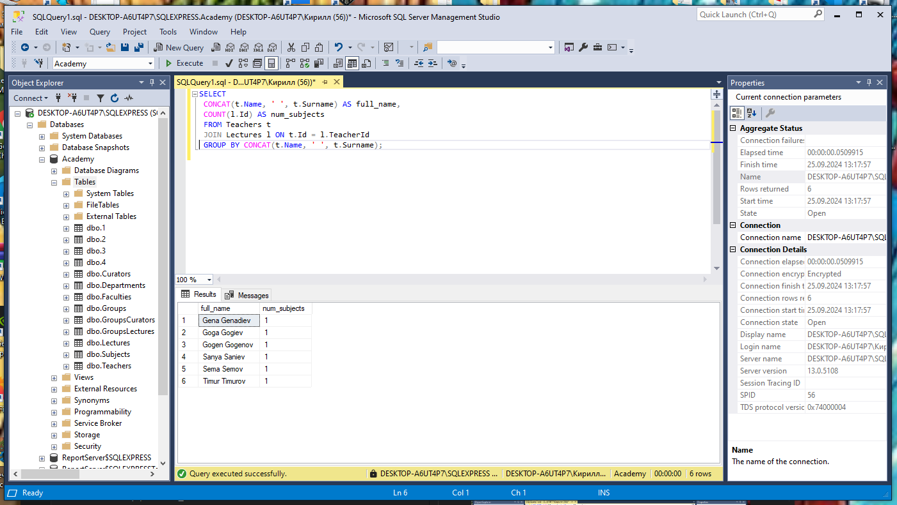

10.  Вывести количество лекций в каждый день недели.

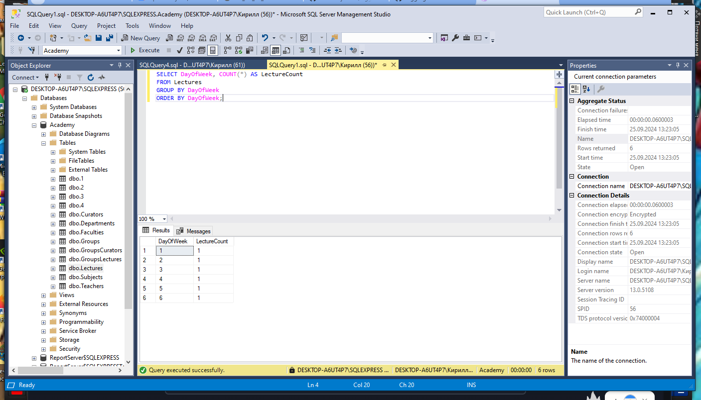

11.  Вывести номера аудиторий и количество кафедр, чьи лекции в них читаются.

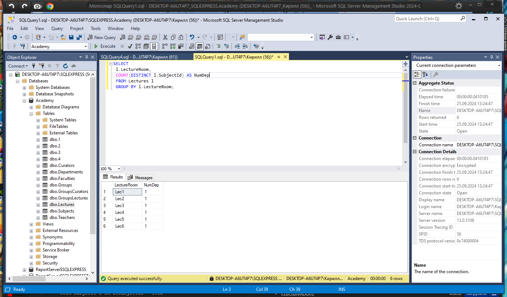

12.  Вывести названия факультетов и количество дисциплин,которые на них читаются.

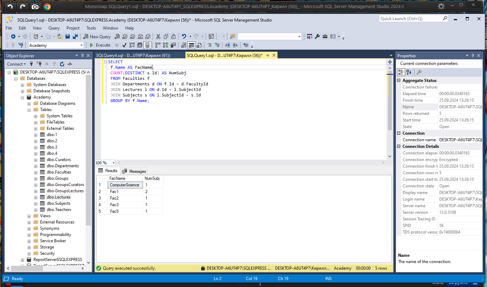