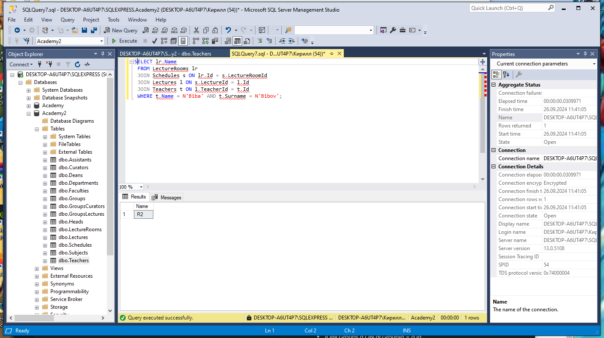
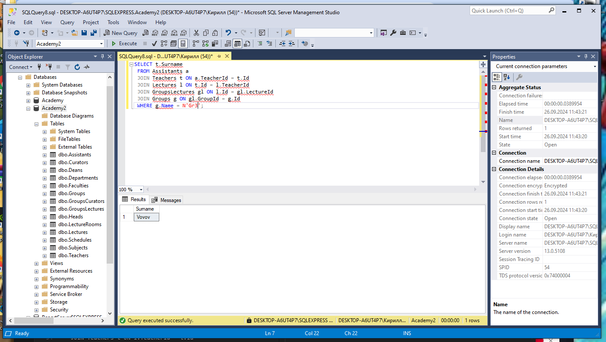
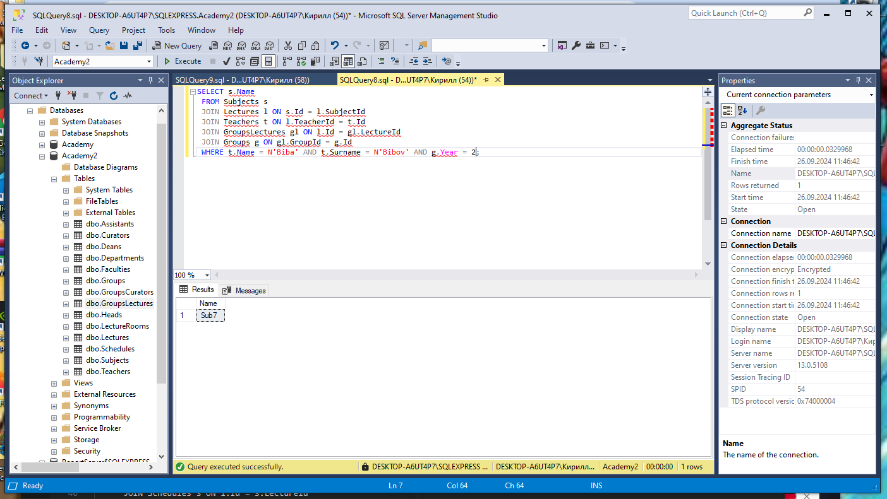
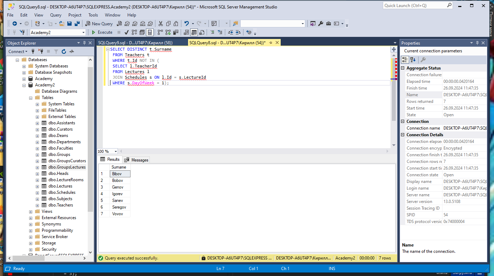
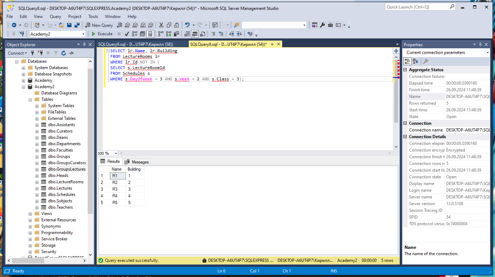
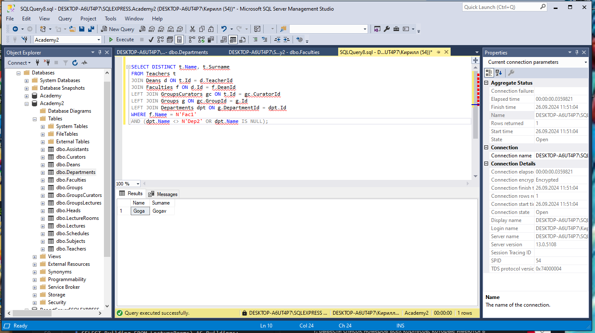
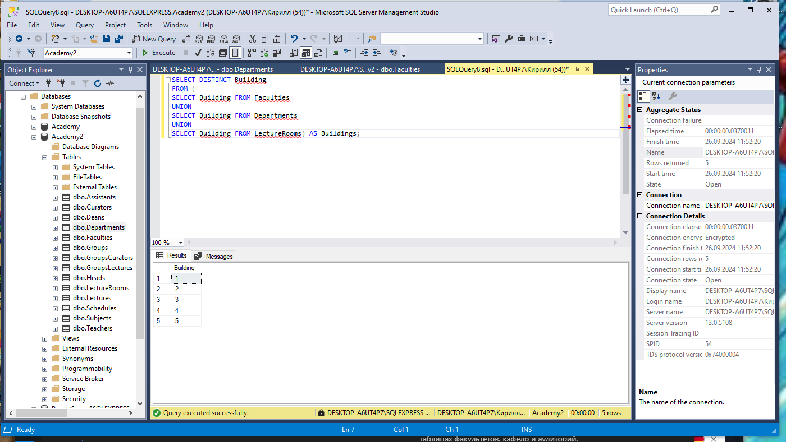
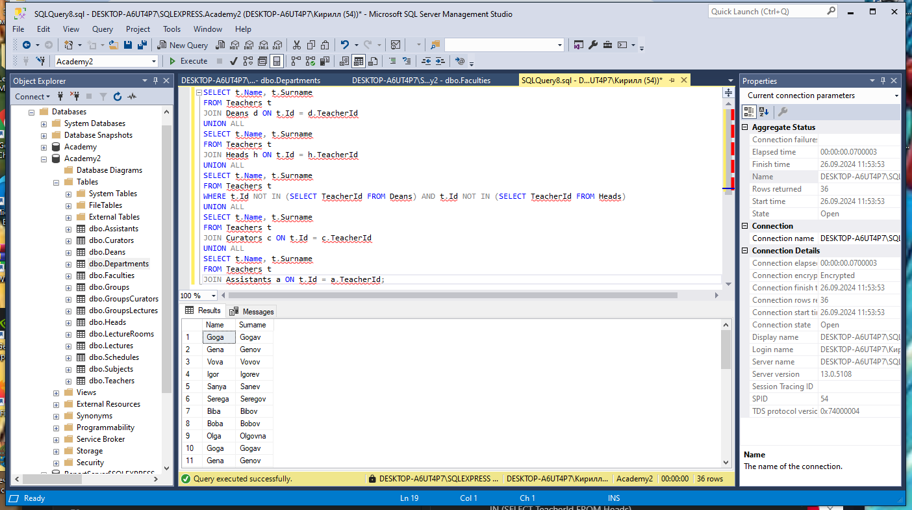
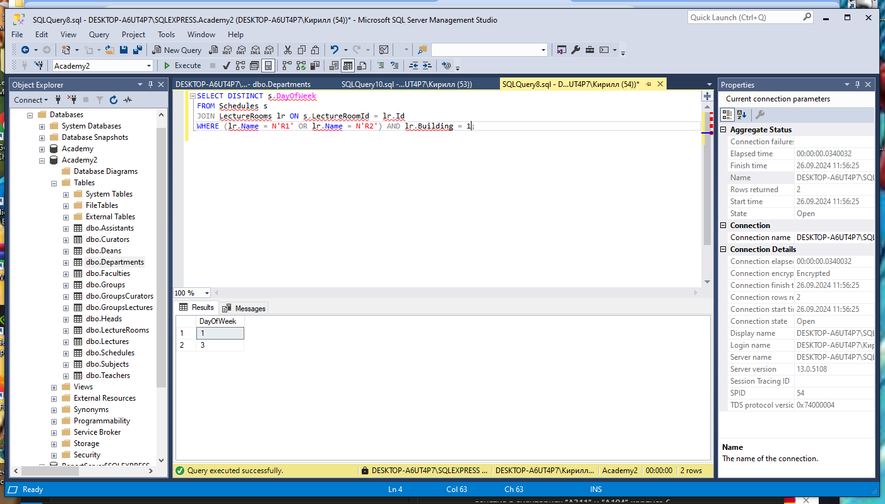

# Теория баз данных

##  Объединения

## Запросы 

1. Вывести названия аудиторий, в которых читает лекции преподаватель “Edward Hopper”.

  
  

2. Вывести фамилии ассистентов, читающих лекции в группе “F505”.

3. Вывести дисциплины, которые читает преподаватель “Alex Carmack” для групп 5-го курса.

4. Вывести фамилии преподавателей, которые не читают лекции по понедельникам.

5. Вывести названия аудиторий, с указанием их корпусов,в которых нет лекций в среду второй недели на третьей паре.

6. Вывести полные имена преподавателей факультета “Computer Science”, которые не курируют группы кафедры “Software Development”.

7. Вывести список номеров всех корпусов, которые имеются в таблицах факультетов, кафедр и аудиторий.

8. Вывести полные имена преподавателей в следующем порядке: деканы факультетов, заведующие кафедрами, преподаватели, кураторы, ассистенты.

9. Вывести дни недели (без повторений), в которые имеются занятия в аудиториях “A311” и “A104” корпуса 6.

